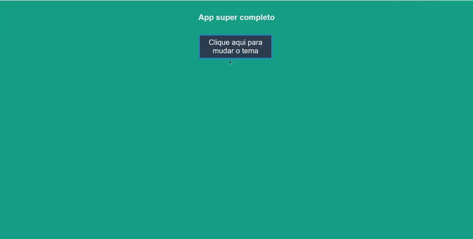

# Themes with Styled Components 
   

  

* [Content (en-US)](#secao-en_us)
* [Conteúdo (pt-BR)](#secao-pt_br)

---

## About the project 

This project was created to be used as a guide to use global themes with Styled Components in a React app.

Check my article in portuguese explaining how to do it [here](https://dev.to/legeannd/temas-globais-em-react-js-utilizando-styled-components-e-context-api-35e0).

## Content
  * [How to run the project](#installation)

## How to run the project 
To run the project, you'll need to have Node and NPM or Yarn installed to setup all the dependencies.

Install all dependencies using the `yarn` command, and run `yarn start` to open the project page on `localhost:3000`.

---

## Sobre o projeto 

Esse projeto foi criado para ser usado como um guia para a aplicação de temas globais com Styled Components em um app em React.

Veja o meu artigo em português explicando como fazer isso [aqui](https://dev.to/legeannd/temas-globais-em-react-js-utilizando-styled-components-e-context-api-35e0).

## Conteúdos
  * [Como executar o projeto](#instalacao)

## Como executar o projeto 
Para executar o projeto, você irá precisar ter o Node e o NPM ou Yarn instalados para baixar as dependências.

Instale todas as dependencias utilizando o comando `yarn`, e rode o comando `yarn start` para abrir o a página do projeto em `localhost:3000`

---
###### Developed by [Gean Lucas](https://www.linkedin.com/in/geanlucaas/) :rocket:.